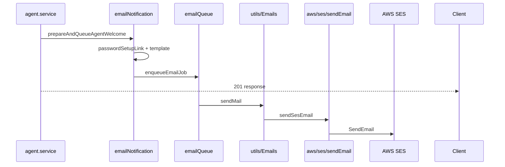
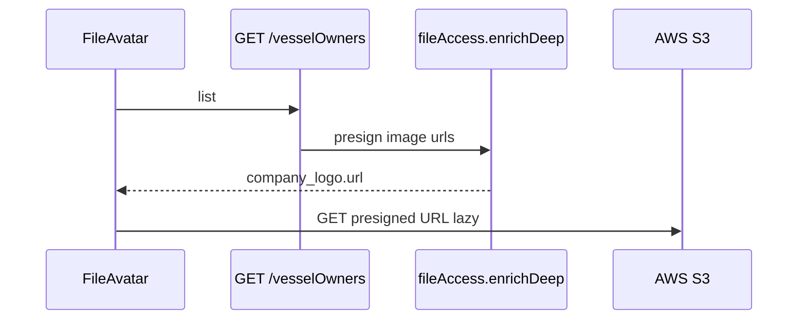

# Data flows (file-by-file)

Step-by-step paths through the codebase. See [FEATURES_AND_SCALING.md](./FEATURES_AND_SCALING.md) for what is **required** vs **optional**.

---

## SES — sending one email

### Path A: Welcome email (new agent)

| Step | File | What happens |
|------|------|----------------|
| 1 | `routes/agent.route.js` | `POST /agents` → middleware → `agent.controller` |
| 2 | `controllers/agent.controller.js` | Calls `agent.service.create` |
| 3 | `services/domain/agent.service.js` | Saves user; calls `prepareAndQueueAgentWelcome` |
| 4 | `services/email/emailNotification.service.js` | `issuePasswordSetupLink` + builds HTML |
| 5 | `services/email/passwordSetupLink.service.js` | Writes `PasswordResetToken` in MongoDB |
| 6 | `services/email/templates/userLifecycle.templates.js` | Returns HTML string |
| 7 | `services/email/emailNotification.service.js` | `enqueueEmailJob(() => sendMail(...))` |
| 8 | `services/email/emailQueue.service.js` | Queues job; runs after HTTP response |
| 9 | `utils/Emails.js` | `sendMail` — picks SES or SMTP from `EMAIL_PROVIDER` |
| 10 | `aws/ses/sendEmail.service.js` | `SendEmailCommand` via AWS SDK |
| 11 | `aws/clients.js` | `getSesClient()` — region, credentials, endpoint |
| 12 | `aws/env.js` | `getSesFromEmail()`, LocalStack vs real AWS |
| 13 | **AWS SES** (or LocalStack) | Message accepted |

### Path B: Forgot password (direct, no queue)

| Step | File | What happens |
|------|------|----------------|
| 1 | `routes/auth.route.js` | `POST /auth/forgot-password` |
| 2 | `controllers/auth.controller.js` | Creates token, builds link |
| 3 | `utils/Emails.js` | `await sendMail(...)` **inline** (blocks until SES returns) |
| 4 | `aws/ses/sendEmail.service.js` | → SES |

### Path C: Agency creation email

`controllers/agency.controller.js` → `utils/Emails.js` → `aws/ses/sendEmail.service.js` (same tail as step 9–13).



---

## S3 — uploading a file (e.g. vessel owner logo)

| Step | File | What happens |
|------|------|----------------|
| 1 | `frontend/utils/s3PresignedUpload.js` | Presign + browser PUT to S3 |
| 2 | `files.controller` → `presignUpload.service.js` | Issues `uploadUrl` + `key` |
| 3 | Browser | PUT bytes **directly to S3** |
| 4 | `routes/vesselOwner.route.js` | `POST /vesselOwners` + `s3_uploads` |
| 5 | `applyPresignedUploads.js` | `req.presignedUploads` |
| 6 | `vesselOwnerFiles.helper.js` | MongoDB file metadata |
| 7 | `vesselOwner.service.js` | Save + `enrichDeep` |

**Candidates/vessels** still use multer → `uploadSync.service.js` (buffer through API).

```mermaid
sequenceDiagram
  participant Browser
  participant Upload as middleware/upload
  participant Sync as aws/s3/uploadSync
  participant Opt as aws/s3/imageOptimize
  participant S3 as aws/s3/storage
  participant DB as MongoDB

  Browser->>Upload: multipart file
  Upload->>Sync: file.buffer
  Sync->>Opt: company_logo only
  Opt->>S3: PutObject
  Sync->>DB: path = S3 key
```

---

## S3 — fetching / displaying files

### Path A: Table logo (typical — optimized)

| Step | File | What happens |
|------|------|----------------|
| 1 | `GET /vesselOwners?page=1` | `vesselOwner.service.list` |
| 2 | `services/domain/vesselOwner.service.js` | `VesselOwner.find()` |
| 3 | `aws/s3/fileAccess.service.js` | `enrichDeep` each row → presigned `url` for `company_logo` |
| 4 | `frontend` `VesselOwners.jsx` | Renders `FileAvatar` per row |
| 5 | `hooks/useFileDisplayUrl.js` | Uses `file.url` from API |
| 6 | `components/FileAvatar/FileAvatar.jsx` | `<Avatar src={url} loading="lazy" />` |
| 7 | **Browser → S3** | One GET per logo (direct, not through your API) |

### Path B: PDF / document open

| Step | File | What happens |
|------|------|----------------|
| 1 | `utils/fileUtils.js` | `getFileURL` → `/files/access?path=...` |
| 2 | `routes/files.route.js` | `verifyToken` |
| 3 | `controllers/files.controller.js` | `resolveAccessUrl` → 302 to presigned URL |
| 4 | Browser | Downloads from S3 |

### Path C: Stream fallback (no `url` on file)

| Step | File | What happens |
|------|------|----------------|
| 1 | `useFileDisplayUrl.js` | `GET /files/stream?path=...` (axios + cookie) |
| 2 | `controllers/files.controller.js` | `getS3ObjectStream` |
| 3 | `aws/s3/objectStream.js` | `GetObject` |
| 4 | Browser | Blob URL for `` |



---

## Quick reference

| Action | Entry route | AWS service |
|--------|-------------|-------------|
| Upload logo | `POST /vesselOwners` | S3 PutObject |
| List logos | `GET /vesselOwners` | S3 presign (in enrichDeep) |
| Open PDF | `GET /files/access` | S3 presign + redirect |
| Send welcome mail | `POST /agents` | SES SendEmail |
