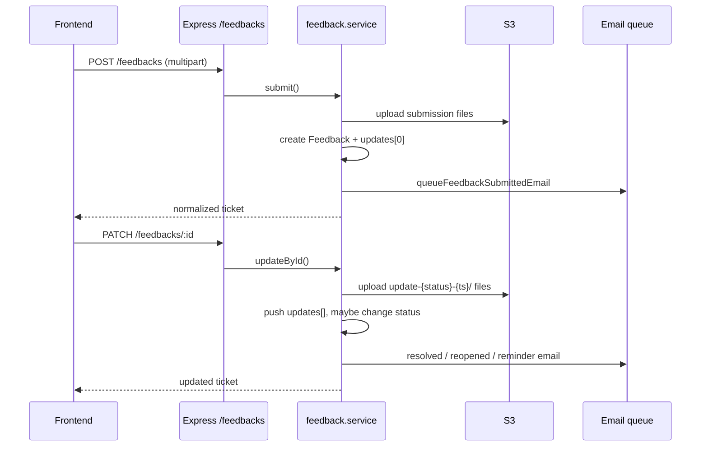

# Feedback system

Feedback is a lightweight ticketing flow inside Maritime CMS. Agents and agency admins submit issues or suggestions; the super admin triages and resolves them; the submitter then closes or reopens the ticket.

---

## 1. How to use it (agents & super admin)

### Who can do what

| Role | Submit feedback | View list | Update status |
|------|-----------------|-----------|---------------|
| **Agent / Agency admin** | Yes (navbar button) | Own agency only (`Our Feedbacks`) | Close or re-open **after** super admin marks resolved |
| **Super admin** | No (by design) | All agencies (`Feedbacks` in sidebar) | In Progress → Resolved; send **Reminder** while waiting on agent |

### Ticket lifecycle

```
Open  →  In Progress  →  Resolved  →  Closed
                              ↘  Reopened  →  (super admin works again)
```

1. **Submit (agent/admin)**  
   - Open **Submit Feedback** from the navbar.  
   - Choose category, title, description, and up to 5 attachments (10 MB each).  
   - Ticket ID is generated per agency (e.g. `SRJA-0001`).  
   - Email goes to the configured inbox (`FEEDBACK_NOTIFY_EMAIL`, e.g. `admin@tursaile.in`) with **Reply-To** set to the submitter and files attached.

2. **Triage (super admin)**  
   - Open **Feedbacks** in the sidebar.  
   - **Update feedback** → set **In Progress** while investigating.  
   - When fixed → **Resolved**, add a required “what was fixed” note, optional attachments.  
   - Submitter gets an email (agency admins CC’d).

3. **After resolved (agent/admin who submitted)**  
   - **Respond to feedback** → **Close** if satisfied, or **Re-open** with a required explanation.  
   - Re-open notifies the super admin inbox again.

4. **Reminder (super admin only, while status is Resolved)**  
   - If the agent has not closed or re-opened yet, the super admin no longer sees “Resolved” as an update option.  
   - Instead: **Send reminder** — adds a thread entry, optional message/files, **status stays Resolved**, email nudges the submitter (agency admins CC’d).

### Viewing files

- **Docs** column in the table → modal with **all** files from submission and every status update.  
- **View feedback** → **Activity** thread only (one attachment block per update; no duplicate top-level attachments section).  
- Clicking any file (PDF, image, Excel, etc.) opens it in a **new browser tab**.

### Status meanings

| Status | Meaning |
|--------|---------|
| Open | Just submitted |
| In Progress | Super admin is working on it |
| Resolved | Super admin marked fixed; waiting on submitter |
| Closed | Submitter confirmed fixed |
| Reopened | Submitter says not fixed; super admin should revisit |
| Reminder | Thread-only action (not a ticket status); nudge while still Resolved |

---

## 2. Technical flow (backend & frontend)

### High-level architecture



### Backend files

| File | Role |
|------|------|
| `backend/models/Feedback.js` | Schema: ticket fields, `attachments[]`, `updates[]` thread (`status` includes `reminder` on entries only) |
| `backend/routes/feedback.route.js` | `POST /`, `GET /`, `GET /:id`, `PATCH /:id` — multer memory, up to 5 files |
| `backend/controllers/feedback.controller.js` | Thin handlers → service |
| `backend/services/domain/feedback.service.js` | Business logic: submit, list, getById, updateById |
| `backend/utils/feedbackTicketId.js` | `{agencyPrefix}-0001` from agency `feedbackCounter` |
| `backend/utils/feedbackFiles.js` | `normalizeFeedback`, `fileWithPath` |
| `backend/middleware/upload.js` | `resolveTenantKeyForUpload` (JWT) + `tenantKeyFromAgencyFields` |
| `backend/services/email/feedbackNotification.service.js` | Queued SES emails: submitted, resolved, reopened, **reminder** |
| `backend/services/email/templates/feedback.templates.js` | HTML templates |

#### Submit (`feedback.service.submit`)

- Resolves agency from JWT (super admin cannot submit).  
- Increments `Agency.feedbackCounter`, builds `ticketId`.  
- Uploads to `{tenantKey}/feedback/{ticketId}/submission/{filename}`.  
- Tenant key = agency `shortName` or `name` from JWT.  
- Creates document with `updates[0]` = open entry (description as `note`, submission attachments).  
- Emails notify inbox with file buffers.

#### Update (`feedback.service.updateById`)

- **Super admin:** `in_progress` \| `resolved` \| `reminder` (only when current status is `resolved`).  
- **Agent/admin:** `closed` \| `reopened` only when current status is `resolved`.  
- Files → `{tenantKey}/feedback/{ticketId}/update-{status}-{timestamp}/`.  
- For super admin uploads, tenant key comes from the **ticket’s agency**, not JWT (`resolveFeedbackTenantKey`).  
- `reminder` appends to `updates[]` but does **not** change `feedback.status`.  
- Emails: resolved → submitter; reopened → notify inbox; reminder → submitter + CC agency admins.

#### List / access control

- Super admin: all tickets.  
- Others: filtered by `req.user.agencyId`.  
- `list` uses `facetPaginate` with `withCounts` so the per-status counts ship **inside the list response** (`aggregates.statusCounts`) in a single request — no separate `/status-counts` call from the UI. The selected status is applied via `statusValue` so the breakdown still counts every status in scope. (The `/status-counts` route/service remain but the table no longer calls them.)

### Frontend files

| File | Role |
|------|------|
| `frontend/src/features/feedback/FeedbackApi.jsx` | REST calls |
| `frontend/src/features/feedback/FeedbackSlice.jsx` | Redux list, selected ticket, submit/update thunks |
| `frontend/src/features/feedback/feedbackFiles.js` | `collectFeedbackAttachments`, `feedbackDocumentSections`, `formatStatusLabel` |
| `frontend/src/features/feedback/components/FeedbackForm.jsx` | Submit dialog (navbar) |
| `frontend/src/features/feedback/components/FeedbacksTable.jsx` | Table, view/update/docs dialogs |
| `frontend/src/features/feedback/components/FeedbackThreadView.jsx` | Activity thread with per-update attachments |
| `frontend/src/pages/FeedbacksPage.jsx` | Page wrapper |
| `frontend/src/hooks/useDocumentActions.js` | `window.open(url, '_blank')` for all file types |
| `frontend/src/components/Documents/DocumentSection.jsx` | File row UI + open-in-new-tab |

#### UI behaviour

- **FeedbacksTable** loads paginated list; super admin sees agency column.  
- **Docs** chip uses `feedbackDocumentSections()` — deduplicated list across submission + updates.  
- **View** modal shows metadata + `FeedbackThreadView` (attachments only inside each update).  
- **Update** modal: status options depend on role and current status (`REMINDER_OPTION` when super admin + resolved).  
- **FeedbackForm** in navbar for `AGENT` / `AGENCY_ADMIN` only.

### File URLs

- Stored S3 keys in `path` / `key`.  
- `getFileURL()` in `fileUtils.js`: images → `/files/stream`, others → `/files/access` (presigned redirect).  
- `useDocumentActions.openDocument()` always opens in a new tab — applies app-wide wherever `DocumentSection` / `useDocumentActions` is used.

### Environment

| Variable | Purpose |
|----------|---------|
| `FEEDBACK_NOTIFY_EMAIL` | Inbox for new submissions and reopen alerts (e.g. `admin@tursaile.in`) |

---

## Possible improvements (optional)

These are not required for the current flow to work:

- **Status filters** on the feedback table (open / in progress / resolved).  
- **Reminder cooldown** so the same ticket cannot be nudged too often.  
- **Deep links** in emails to open the ticket directly in the app.  
- **In-app notifications** in addition to email.  
- **SLA / due dates** for super admin response time.  
- **Audit export** (CSV) for closed tickets per agency.
