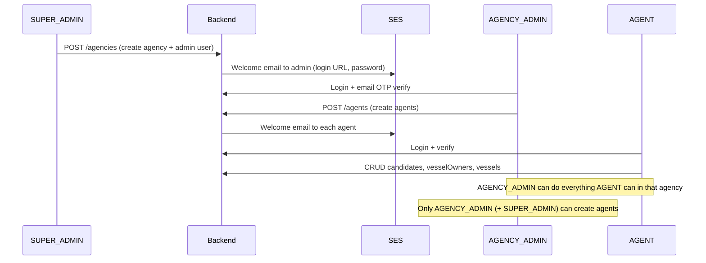

# Multi-tenancy, onboarding flow, and per-agency uniqueness

Maritime CMS is a **multi-tenant** app. Each **Agency** is one tenant. Users, candidates, vessel owners, vessels, and files are scoped to an agency unless the user is `SUPER_ADMIN`.

---

## Tenant model (short)

| Concept | Implementation |
|---------|----------------|
| Tenant | `Agency` document (`agencyId` on records) |
| Tenant admin | `User` with `role: AGENCY_ADMIN` and `agencyId` |
| Tenant staff | `User` with `role: AGENT` and `agencyId` |
| Platform admin | `User` with `role: SUPER_ADMIN` (no `agencyId` required) |
| Data isolation | Queries filter by `agencyId` for non–super-admin users |
| Uniqueness | Same field value may exist in **different** agencies; **not** twice in the **same** agency |

**Example:** `amritpalsingh2789@gmail.com` can be a candidate in Agency A and Agency B. Two candidates with that email in Agency A is **not** allowed.

---

## Onboarding flow (start to daily work)



### Step-by-step

1. **Super admin creates an agency** (`POST /agencies` in `agency.controller.js`).
   - Creates `Agency` and first `User` with `role: AGENCY_ADMIN`, `agencyId` set.
   - Sends welcome email (credentials + login link) via SES/`sendMail`.

2. **Agency admin logs in** (`/auth`).
   - Email verification OTP flow as configured.
   - Sees only their agency’s data.

3. **Agency admin creates agents** (`POST /agents`, `AGENCY_ADMIN` or `SUPER_ADMIN` only).
   - Each agent is a `User` with `role: AGENT`, same `agencyId`.
   - Welcome email queued (`prepareAndQueueAgentWelcome`).

4. **Agents (and agency admin) do operational work**

### User account status (`User.status`)

| Status | Meaning | Can log in? |
|--------|---------|-------------|
| `unverified` | Created; password not set via email link yet | No — message: check email for setup link |
| `active` | Password set (or super admin) | Yes |
| `inactive` | Deactivated by agency admin | No — message: contact agency admin |

No OTP step after password setup — the secure email link is the verification.

   - Candidates: `POST /candidates`, resume parse, documents.
   - Vessel owners: `POST /vesselOwners`.
   - Vessels: `POST /vessels`.
   - Agents **cannot** create other agents; agency admin **can**.

5. **Authorization** (`middleware/authorization.js`)
   - `authorize("AGENT", "AGENCY_ADMIN", "SUPER_ADMIN")` on domain routes.
   - `checkAgencyStatus` — inactive agency blocked for non–super-admin.
   - `agencyId` on JWT/user used to scope reads and writes.

---

## Per-entity uniqueness (within one agency only)

Enforced in services via `backend/utils/tenantUniqueness.js` → `assertUniqueWithinAgency`.

| Entity | Unique within `agencyId` | Notes |
|--------|--------------------------|--------|
| **Candidate** | `email`, `indosNumber`, `aadharNumber`, `panNumber` | Each checked separately; clear error per field |
| **Vessel owner** | `company_shortname`, `company_name`, `email` | Fixes duplicate “Test Dynamic Form2” in same agency |
| **Vessel** | `vesselname` | |
| **Agent** | `email` | Among `AGENT` / `AGENCY_ADMIN` in that agency |
| **Future entities** | At least one business key | Always pass `agencyId` + optional `excludeId` on update |

Updates re-run checks with `excludeId` so editing a record does not match itself.

---

## File upload order (no orphans on validation failure)

**Rule:** Never upload to S3 until the main create/update API succeeds.

### Create flow

1. `POST /candidates` (or `/vesselOwners`, `/vessels`) — **fields only**, no files.
2. Backend validates tenant uniqueness → saves document.
3. Frontend calls `POST /files/upload` per file (with folder key).
4. `PATCH /:id` with `s3_uploads` JSON to attach metadata.

### S3 object keys (`backend/middleware/uploadRules.js`)

All uploads are **tenant-first** so the same business key in two agencies never collides in the bucket:

| Entity | S3 key pattern | Subfolder from |
|--------|----------------|----------------|
| Candidates | `{agencyShortName}/candidates/{indosNumber}/` | `indosNumber` |
| Vessel owners | `{agencyShortName}/vesselowners/{company_shortname}/` | `company_shortname` |
| Vessels | `{agencyShortName}/vessels/{vesselname}/` | `vesselname` |

- **Tenant segment:** agency `shortName` from the JWT; if missing, sanitized `agencyName` (set at login).
- Uploads with subfolder `unknown` or missing tenant label on the token are **rejected**.
- Set **Agency Short Name** on each agency (falls back to full name when empty).

### Parse resume

`POST /candidates/parse-resume` only **parses** the PDF/DOC and returns form hints. It does **not** upload to S3. The resume file is uploaded in step 3 after the candidate row exists (same as other documents, field `resume` → `documents.resume.main`).

---

## Code map

| Concern | Location |
|---------|----------|
| Uniqueness helper | `backend/utils/tenantUniqueness.js` |
| Candidate checks | `candidate.service.js` → `assertCandidateUniqueInAgency` |
| Vessel owner checks | `vesselOwner.service.js` → `assertVesselOwnerUniqueInAgency` |
| Vessel checks | `vessel.service.js` → `assertVesselUniqueInAgency` |
| Agent email | `agent.service.js` (scoped by `agencyId`) |
| Upload after save (UI) | `frontend/src/utils/entitySubmitWithFiles.js` |
| S3 upload API | `POST /files/upload` |

---

## Prompt for other AI tools (copy-paste)

Use this when explaining Maritime CMS tenancy to another assistant:

```
You are working on Maritime CMS, a multi-tenant maritime crewing app.

TENANT = Agency (MongoDB Agency + agencyId on all tenant data).

ROLES:
- SUPER_ADMIN: platform-wide; can create agencies; may pass agencyId on writes.
- AGENCY_ADMIN: one agency; full CRUD on candidates, vessel owners, vessels; can create agents in that agency only.
- AGENT: same CRUD as agency admin for operational data; CANNOT create agents.

ONBOARDING:
1) Super admin POST /agencies → creates Agency + AGENCY_ADMIN user → welcome email.
2) Agency admin logs in (OTP verify).
3) Agency admin POST /agents → AGENT users + welcome emails.
4) Agents/admins create candidates, vessel owners, vessels.

UNIQUENESS (critical):
- Duplicate checks are PER agencyId (tenant), NOT global.
- Same email/indos may exist in Agency A and Agency B.
- Same email/indos twice in Agency A must return 400.

Per-entity unique fields within agencyId:
- Candidate: email, indosNumber, aadharNumber, panNumber
- VesselOwner: company_shortname, company_name, email
- Vessel: vesselname
- Agent: email (agents/admins in that agency)

FILE UPLOADS:
- Never upload to S3 before POST /candidates (or /vesselOwners, /vessels) succeeds.
- Flow: create record → POST /files/upload per file → PATCH with s3_uploads JSON.
- S3 keys: {agencyShortName|agencyName}/candidates/{indosNumber}/, etc.
- JWT includes agencyName, agencyShortName, agencyEmail for tenant users (navbar + uploads).
- parse-resume does NOT upload; only returns parsed fields.

Implement new entities with agencyId scoping and assertUniqueWithinAgency for at least one business key.
```

---

## Related docs

- [BACKEND_FLOW.md](./BACKEND_FLOW.md) — route → controller → service
- [FILES_AND_S3.md](./FILES_AND_S3.md) — S3 and `/files/*`
- [MIDDLEWARE.md](./MIDDLEWARE.md) — auth and roles
